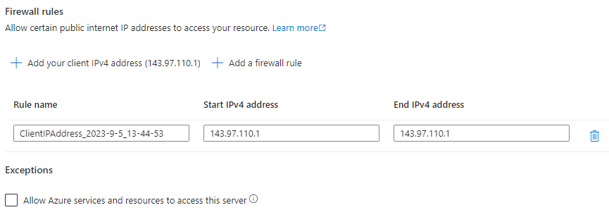
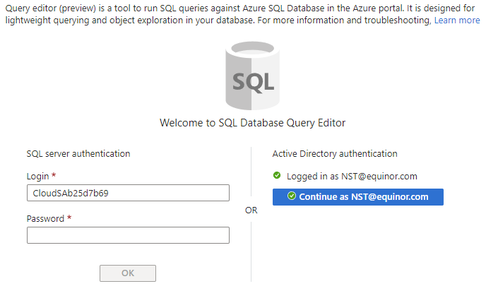

# Configure Azure SQL Database, schema and permissions

Follow these steps to create a new Azure SQL Server and database, create a table with test data, and grant the managed identity permission to SELECT from the table.

## 1. Create SQL Server and database:
- Create a SQL Server by running the following command in the terminal:
  ```
  az sql server create --subscription d1775405-6d42-4fba-99ac-3cae223d9087 \
  --resource-group EDC23-Radix-Workshop \
  --enable-ad-only-auth \
  --location northeurope \
  --external-admin-principal-type User \
  --external-admin-sid $(az ad signed-in-user show -otsv --query id) \
  --external-admin-name "$(az ad signed-in-user show -otsv --query mail)" \
  --name sql-edc23-radix-workshop-$(az ad signed-in-user show -otsv --query mail | awk -F"@" '{print tolower($1)}')
  ```
- Open the [EDC23-Radix-Workshop](https://portal.azure.com/#@StatoilSRM.onmicrosoft.com/resource/subscriptions/d1775405-6d42-4fba-99ac-3cae223d9087/resourceGroups/EDC23-Radix-Workshop/overview) resource group, find and open your SQL Server and go to `Networking` to configure firewall rules to allow your current public IP address to connect:  
  
- Add a firewall rule to allow connections from Radix Playground by running the following command:
  ```
  az sql server firewall-rule create --subscription d1775405-6d42-4fba-99ac-3cae223d9087 \
  --resource-group EDC23-Radix-Workshop \
  --server sql-edc23-radix-workshop-$(az account show -otsv --query=user.name | awk -F"@" '{print tolower($1)}') \
  --name radix_playground \
  --start-ip-address '104.45.86.104' \
  --end-ip-address '104.45.86.107'
  ```
- Create the database `moviedb` with the following command:
  ```
  az sql db create --subscription d1775405-6d42-4fba-99ac-3cae223d9087 \
  --resource-group EDC23-Radix-Workshop \
  --server sql-edc23-radix-workshop-$(az account show -otsv --query=user.name | awk -F"@" '{print tolower($1)}') \
  --auto-pause-delay 120 \
  --zone-redundant false \
  --backup-storage-redundancy Local \
  --compute-model Serverless \
  --edition GeneralPurpose \
  --family Gen5 \
  --capacity 1 \
  --name moviedb
  ```
## 2. Setting up the database:
   - Open the [EDC23-Radix-Workshop](https://portal.azure.com/#@StatoilSRM.onmicrosoft.com/resource/subscriptions/d1775405-6d42-4fba-99ac-3cae223d9087/resourceGroups/EDC23-Radix-Workshop/overview) resource group, find and open your SQL Server (you can type your user name in the `Filter` field), go to `SQL databases` and click on the `moviedb` database to open.
   - Click `Query editor (preview)` in the left menu, and then the blue `Continue as <your email>` button.  
   
   - Open the `sql` directory in this repo, copy the content of each file in into the query editor and run it (`Run` button or press `Shift + Enter`):
     - `1-schema.sql`
     - `2-sample-data.sql`
     - `3-access.sql` - replace `<your user name>` in line 5 and 9 with your user name.

The database is now ready and should be accessible from your application using workload identity.          
