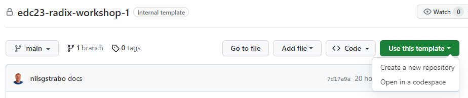
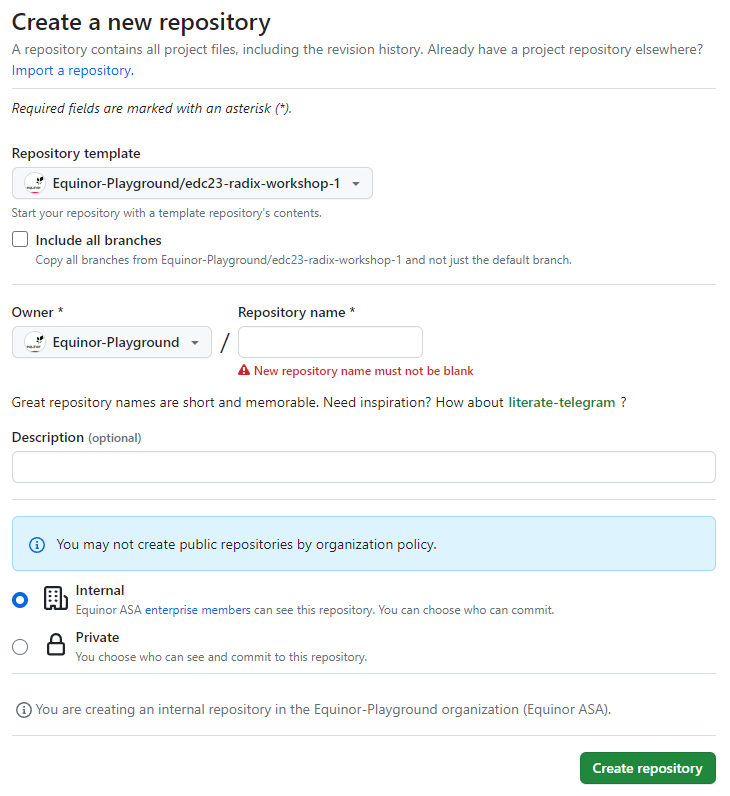
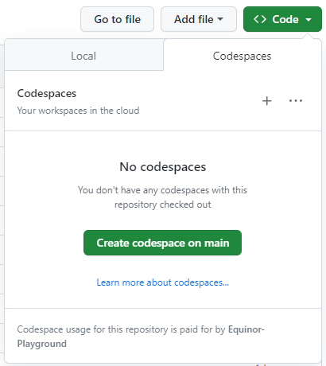
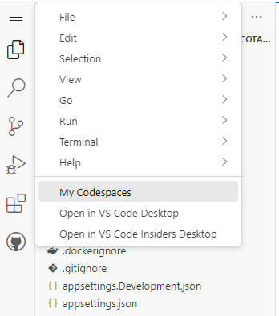
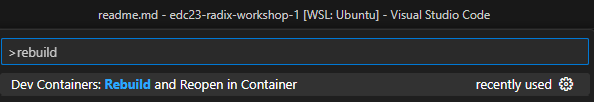

# Configure GitHub reposistory

Follow these steps to create a new GitHub repository using [edc23-radix-workshop-1](https://github.com/Equinor-Playground/edc23-radix-workshop-1) as template.

- Open [https://github.com/Equinor-Playground/edc23-radix-workshop-1](https://github.com/Equinor-Playground/edc23-radix-workshop-1) and click `Use this template` -> `Create a new repository`.  
  
- Give the repository a name in the `Repository name` field, and then click `Create repository`.  
  

 

---

 

It is up to you to decide if you want to use `GitHub Codespaces` or `Dev Containers`.

**GitHub Codespaces:**

- Click `Code` -> `Create codespace on main`.  
  
- Wait for the `Setting up your codespace` screen to complete (should take approximately one minute).
- You can now work with the repository in the browser, or you can open it in your local VS Code (requires the `GitHub Codespaces` extension).
- To work in your local VS Code, click the `hamburger icon` -> `Open in VS Code Desktop`.  
  
- The browser or VS Code may prompt you to confirm that you want to open the link/file. Click the `Open...` button to confirm.

**Dev Containers:**

- Clone the repository and open it in VS Code.
- Press `F1`, type `rebuild` and select `Dev Container: Rebuild and Reopen in Container`.  
  
