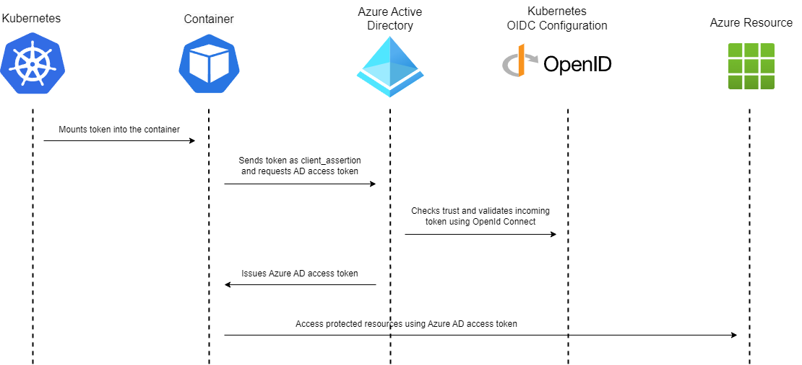

# Workload Identity

[Workload Identity](https://www.radix.equinor.com/guides/workload-identity/#workload-identity) enables applications running in Radix to access protected Azure resources. It replaces the need for using long lived client secrets with short lived JWT tokens when acquiring Azure AD access tokens.

The Kubernetes cluster that Radix runs in acts as a token issuer and mounts a JWT token into the file `/var/run/secrets/azure/tokens/azure-identity-token` in the component/job container that uniquely identifies this workload by combining the application, environment and component/job name in the `sub` claim.

This token can be exchanged for an Azure AD token using the [OAuth2 client credentials flow](https://learn.microsoft.com/en-us/azure/active-directory/develop/v2-oauth2-client-creds-grant-flow#third-case-access-token-request-with-a-federated-credential) with the token as `client_assertion`. Azure AD uses OpenId Connect to discover public signing keys from the Kubernetes identity provider in order to verify the authenticity of the token. Token claims are then checked against the list of registered trust relationships for the Azure managed identity or AD application.

When workload identity is enabled for a component or job, the following environment variables are set in the container:
- `AZURE_CLIENT_ID` : The clientId set in radixconfig.yaml for the component.
- `AZURE_AUTHORITY_HOST` : The base URL to Azure AD identity provider.
- `AZURE_TENANT_ID`: The tenant ID to use when acquiring access tokens from Azure AD.
- `AZURE_FEDERATED_TOKEN_FILE`: Path to the file containing the workload identity JWT.

Workload Identity can also be used with the [Azure Key Vault](https://www.radix.equinor.com/references/reference-radix-config/#azurekeyvault) feature in Radix.

The Azure.Identity library and the .NET ADO.NET SQL Server driver have native support for workload identity credentials.

Azure.Identity is available for multiple languages, and if your favourite language is not in the list, you can always use the environment variables listed above to build a raw HTTP request to acquire an access token.
